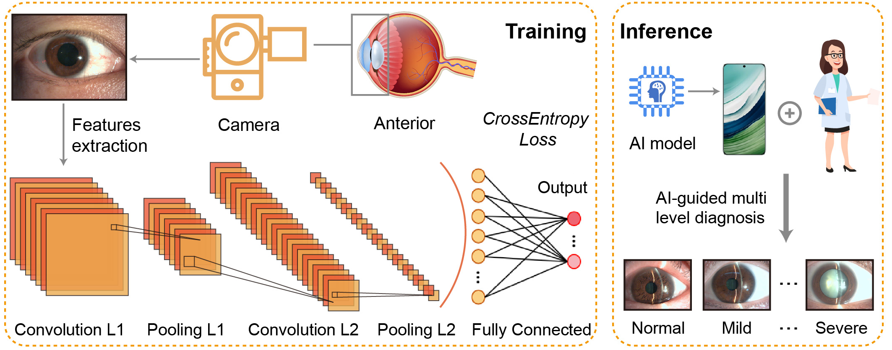
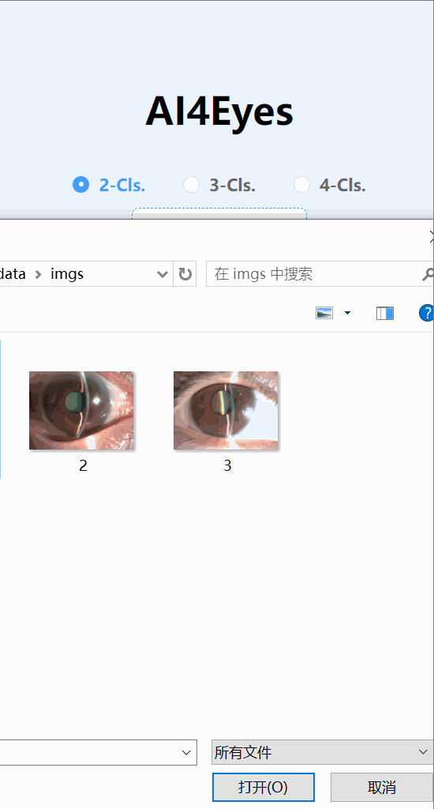
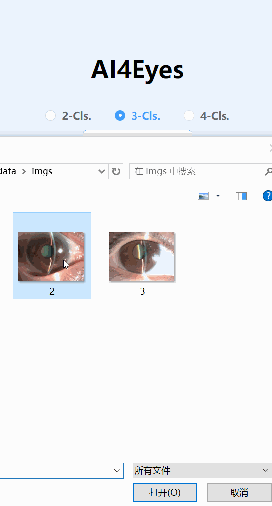
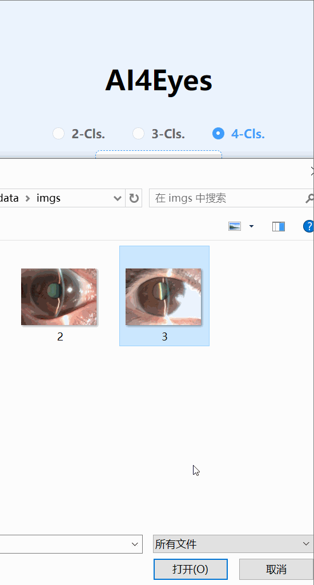

# eye_images
This repository contains the official implementation for "Multi-level diagnosis of cataract from anterior images via deep learning".


## Deployment Demo
You can access the AI-guided diagnosis models when uploading an anterior image through edge devices (i.e. smartphone, tablet and laptop).
Here is the demo link: http://eye.masaikk.icu


<div style="display:flex;">
    
    
    
</div>


## Installation 
Tested on:
Ubuntu 20 with torch 2.0 & CUDA 11.8 on an A100.\
Windows 10 with torch 1.10 & CUDA 10.2 on a GTX1650.
```python
conda create -n ai4eyes python==3.8
pip install torch==1.10.0+cu102 torchvision==0.11.0+cu102 torchaudio==0.10.0 -f https://download.pytorch.org/whl/torch_stable.html
```

## Data pre-processing
Split into train / val / test
```python
cd misc
python pre_proces.py --img-dir cataract_org --out-dir cataract_img
```


## Training
To facilitate AI-guided multilevel diagnosis, three deep learning models (i.e. binary, three-level classification and four-level classification model) have been trained.
```python
python train.py --out-dir output_path --batch-size 64 --inet-pretrain
```

## Test
To test the performance of trained model, load the saved checkpoints which we have provided in the checkpoints folds.
```python
new_net = models.resnet18(pretrained=args.inet_pretrain)
new_net.fc = nn.Linear(512, args.nb_cls)
new_net.load_state_dict(torch.load('net_cataract.pt'))
```

## t-Distributed Stochastic Neighbor Embedding (t-SNE)
t-SNE is used for visualization and exploratory data analysis of deep learning models.
```python
python t-SNE.py
```

## Class Activation Mapping (CAM)
CAM is a technique used in computer vision to visualize and understand the 
important regions of an image that contribute to the classification decision made by a deep learning model.
```python
python CAM.py
```